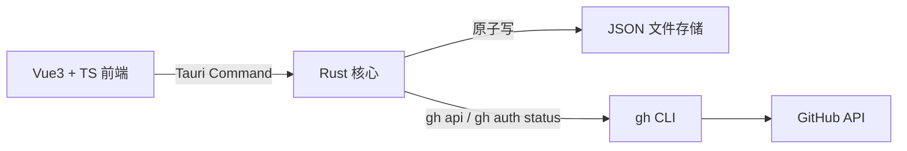

# MayDolist

> 藏在屏幕角落的 Windows 便签与 GitHub 追踪台。

MayDolist 是一款面向 Windows 的「收纳式」桌面便签应用。它平时隐藏在屏幕角落与系统托盘，鼠标划过热角或按下全局快捷键即可呼出主面板，集 Todo 待办、桌面悬浮便签、按项目追踪的 GitHub PR / Issue、标签速记于一体——让待办、笔记与开发进度都收纳在一个随时可唤出的面板里。

## 功能特性

- **收纳式呼出**：鼠标滑到屏幕热角（默认右上角，可配置）或按全局快捷键（默认 `Ctrl+Alt+M`）呼出 / 隐藏主面板；系统托盘图标常驻。
- **Todo 待办**：创建待办、勾选完成（划线展示）、软删除，支持多列表组织。
- **便签**：在主面板内快速记录，可拖出为独立桌面悬浮小窗（置顶、可收起）。
- **GitHub 追踪**：按项目（仓库）分组，可增删追踪仓库；展开查看未合并 PR 与「我的 / 被提及 / 被分配 / 参与」的 issue 与 PR；点击条目在浏览器打开；本地缓存 + 手动 / 定时刷新，离线可查看缓存。
- **标签速记**：自由增删改标签，按标签组织速记内容，保存到指定数据目录。
- **数据本地化**：所有数据保存在本机，存储路径可配置。

## 技术架构

- **Tauri 2（Rust 后端）**：负责窗口管理、文件读写与 gh 调用
- **Vue 3 + TypeScript + Vite（前端）**：主面板与悬浮便签界面
- **gh CLI**：GitHub 集成通道
- **JSON 文件存储**：文件夹形式的本地数据



所有文件读写与 gh 调用统一由 Rust 后端处理，前端不直接接触文件系统。

## 数据存储

默认数据目录：`%USERPROFILE%\Documents\MayDolist`（后续设置 UI 可配置）。

```text
MayDolist/
├── config.json              # 数据目录、呼出角、快捷键、主题、刷新间隔
├── notes/<id>.json          # 便签：标题/内容/标签/颜色/置顶/窗口位置
├── todos/<id>.json          # 待办：多列表、完成与软删除状态
├── snippets/<id>.json       # 速记：标签与内容
└── github/
    ├── watchlist.json       # 追踪仓库列表
    └── cache/               # PR / issue 快照缓存
```

写策略：全部经 Rust 单进程原子写（临时文件 + 重命名），多窗口并发安全。

## GitHub 集成设计

- 启动时通过 `gh auth status` 检测登录状态。
- 数据经 `gh api`（`--paginate`）读取 REST 接口获取 issue / PR 列表。
- 过滤维度：「我的」（author）、「被提及」（mentioned）、「被分配」（assignee）、「参与」（involved）的 issue 与 PR，以及未合并 PR。
- 展示本地缓存：刷新失败或离线时展示上次快照并提示刷新失败。
- 点击条目在系统浏览器打开对应页面。

## 开发环境与构建

环境要求（Windows）：

- Rust（通过 rustup 安装）
- Node.js 22+ 与 pnpm
- WebView2（Windows 11 自带，Windows 10 需安装）

```powershell
pnpm install
pnpm tauri dev        # 开发模式
pnpm tauri build      # 构建便携 exe
```

构建产物为单文件便携 exe（前端资源内嵌，依赖系统 WebView2），免安装直接运行。

## Roadmap

- **v0.1**：Todo 待办 + 收纳式呼出（热角 / 快捷键 / 托盘）
- **v0.2**：GitHub 项目追踪（增删仓库、PR / issue 展示、缓存刷新）
- **v0.3**：独立悬浮便签窗 + 标签速记
- **v1.0**：设置 UI、开机自启、NSIS 安装包

## License

[MIT](LICENSE)
