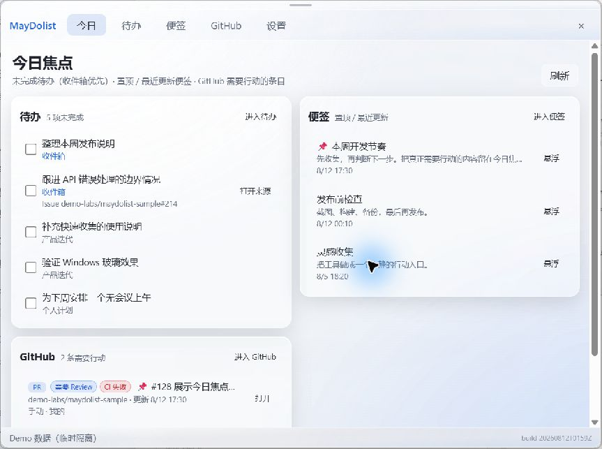
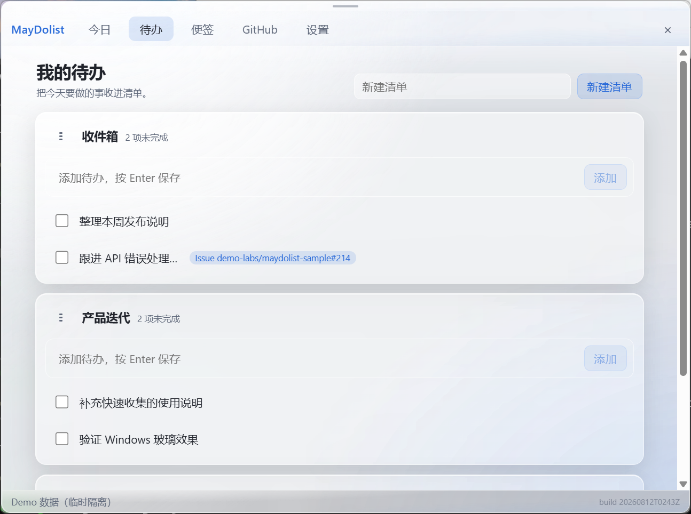
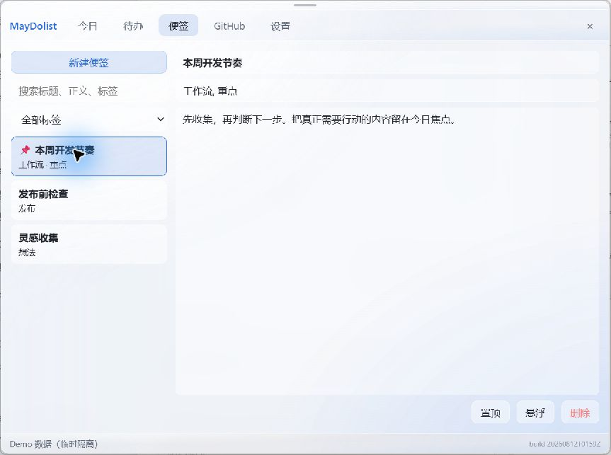
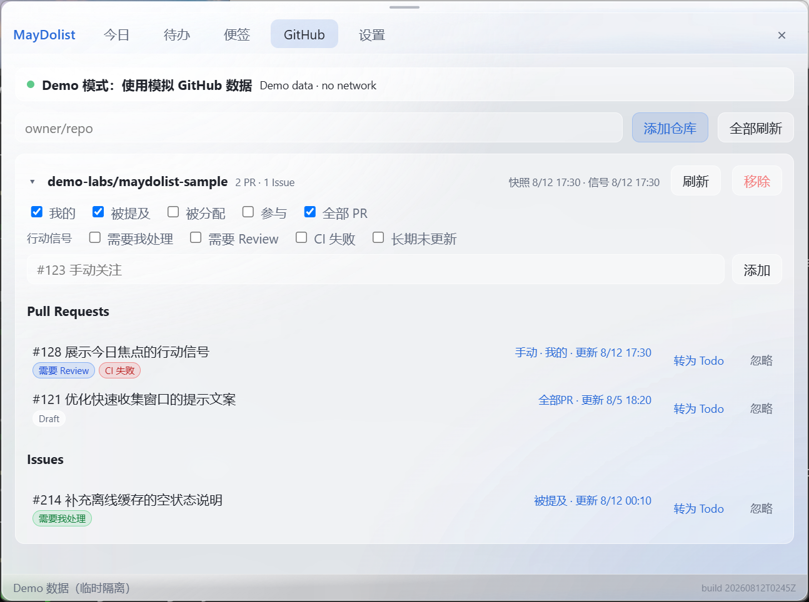
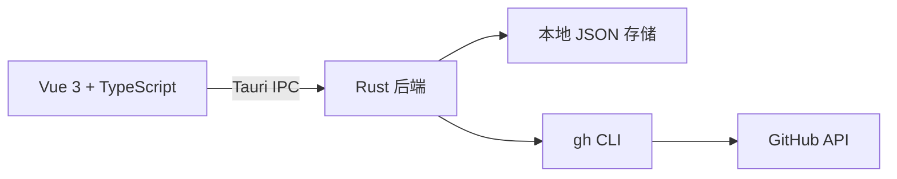

# MayDolist

> 面向 Windows 开发者的本地优先行动收件箱：把 Todo、便签和 GitHub 工作上下文放在一个安静、随时可召回的桌面入口里。

MayDolist 适合那些需要在编码、Review 和日常工作之间快速切换的人。它常驻系统托盘，平时保持安静；需要记录想法时，用全局快捷键快速收集；需要开始工作时，从「今日焦点」看到真正需要行动的内容。



> 上图及下方截图均使用仓库内置的脱敏 Demo 数据，不代表真实用户、仓库或工作内容。

## 核心体验

### 今日焦点

打开面板默认进入「今日」，把未完成 Todo、置顶或最近更新的便签，以及 GitHub 中需要行动的 PR / Issue 聚合到同一视图。未完成 Todo 按**已逾期 → 今天到期 → 近期 7 天 → 无日期**分组展示：逾期条目高亮置顶、分组标题显示数量，一眼看出「哪件事已经晚了」。每条内容都提供最小必要动作：完成待办、打开来源、进入对应模块或将便签悬浮到桌面。

### 快速收集

不需要先打开主面板：

- `Ctrl+Alt+Space` 呼出快速收集窗口，再按一次即可收起。
- 普通文本保存为 Todo，并进入「收件箱」。
- 支持最小自然语言到期日前缀：`明天 提交周报`、`周五 清理 stale PR`、`3天后 复查`、`月底 发布`——解析结果自动写入到期日；没有日期前缀时就是普通 Todo。
- 单独输入 `/note` 可创建并打开一个空白悬浮便签。
- `Enter` 提交，`Esc` 或右上角关闭按钮收起窗口；未提交的输入会保留。
- `Ctrl+Alt+M` 或屏幕热角呼出 / 隐藏主面板。

### Todo 与便签

Todo 支持多个清单、完成、排序、软删除和 GitHub 来源关联；每条待办还可以设置到期日、提醒时间与周期规则（每天 / 每周 / 每两周 / 每月）——完成周期任务后自动生成下一次实例，直到重复截止日。到期的任务会通过 Windows 通知提醒你，点击通知直接打开面板并聚焦该条待办；通知不可用或处于安静时段时，托盘图标会显示红色逾期数字徽标（0 时自动隐藏）。便签支持搜索、标签、置顶、自动保存，也可以拖出为独立桌面悬浮窗。





### GitHub 追踪

按仓库组织 PR 和 Issue，支持「我的」「被提及」「被分配」「参与」等筛选，并显示需要处理、需要 Review、CI 失败、长期未更新和 Draft 等行动信号。条目可以直接打开 GitHub 原文，或一键转成带来源的 Todo。



### 本地优先与可恢复

- Todo、便签、配置和 GitHub 快照默认保存在本机 JSON 文件中。
- 支持创建备份、导出数据包、导入预览和失败回滚。
- 导出包不包含 GitHub token、认证文件、环境变量或日志。
- GitHub 网络不可用时，仍可查看本地缓存。
- 提醒完全本地：到期通知与托盘徽标由本机 Rust 进程调度，不依赖任何云端服务。

## 行动闭环

```text
捕获 → 判断下一步 → 执行 → 回到来源
```

快速收集和托盘入口降低记录成本；「今日焦点」帮助判断下一步；Todo、便签和 GitHub 页面承接执行；带来源的 Todo 又能回到原始 PR / Issue，保留开发上下文。

## 快速开始

### 环境要求

- Windows 11 + WebView2 Runtime
- Node.js 22+
- pnpm 11+
- Rust stable MSVC toolchain
- 可选：GitHub CLI `gh`。只有使用 GitHub 追踪时才需要，并通过 `gh auth login` 完成登录。

### 开发运行

```powershell
pnpm install
pnpm tauri dev
```

首次启动会在 `%USERPROFILE%\Documents\MayDolist` 创建本地数据目录。可通过 `MAYDOLIST_DATA_DIR` 指定其他目录：

```powershell
$env:MAYDOLIST_DATA_DIR = "D:\MayDolist-data"
pnpm tauri dev
```

### 构建 Windows 安装包

```powershell
pnpm tauri build --bundles nsis
```

更多 CI、发布、更新签名和构建说明见 [docs/building.md](docs/building.md)。

## Demo 截图

README 截图来自真实的 Vue + Tauri 界面，而不是单独绘制的静态 Mock。Demo 模式会：

- 在系统临时目录创建按进程隔离的数据目录；
- 写入固定的 Todo、便签、仓库、PR 和 Issue 模拟数据；
- 跳过 GitHub 网络请求和本地 `gh` 登录状态；
- 不读取或修改正式的 MayDolist 数据目录。

运行 Demo（推荐）：

```powershell
pnpm demo
```

底层 Tauri 命令等价于 `pnpm tauri dev -- -- --demo`；连续两个 `--` 用于将参数继续传递给最终的应用进程。截图文件位于 [docs/screenshots](docs/screenshots)。

## 技术架构



- **Tauri 2 + Rust**：窗口、系统托盘、全局快捷键、文件读写、备份和 GitHub CLI 调用。
- **Vue 3 + TypeScript + Vite**：主面板、今日焦点、Todo、便签、GitHub 和设置页面。
- **Pinia**：前端状态与跨窗口刷新事件。
- **JSON 文件存储**：简单、可检查、可导出，写入采用临时文件替换保证原子性。
- **GitHub CLI**：MayDolist 不在应用内保存 GitHub token，也不实现 GitHub 写操作。

所有文件系统访问和 GitHub 调用都由 Rust 后端统一处理，前端只通过 Tauri command 访问数据。

## 项目结构

```text
src/
  api/                 Tauri command 的前端封装
  stores/              Pinia 状态
  views/               今日、Todo、便签、GitHub、设置和快速收集
  types/               与 Rust model 对应的 TypeScript 类型
src-tauri/src/
  commands/            Tauri command 接口
  services/            Todo、便签、GitHub、Focus、提醒和备份服务
  models/              serde 数据模型
  storage/             数据目录、原子写入和迁移
  demo.rs              截图用的隔离模拟数据
docs/
  architecture.md     详细架构说明
  building.md          构建与发布说明
  screenshots/         README 展示截图
```

## 隐私边界

MayDolist 的产品边界是「本地优先的个人行动台」，不是云同步服务：

- 不提供云端同步、多端同步、移动端或 Web 端。
- 不在应用内嵌入 GitHub 登录，也不读取或存储 GitHub token。
- 默认只读取 GitHub 信息，不创建、合并或评论 PR / Issue。
- 外部链接统一交给系统浏览器打开。

## 质量检查

```powershell
pnpm check
pnpm build
cargo fmt --manifest-path src-tauri/Cargo.toml --all -- --check
cargo clippy --manifest-path src-tauri/Cargo.toml --all-targets -- -D warnings
cargo test --manifest-path src-tauri/Cargo.toml
```

## 项目状态

当前版本：`1.2.1`。核心 Todo（含到期日、提醒与周期任务）、便签、Focus（按到期状态分组）、GitHub 缓存追踪、快速收集（含日期前缀解析）、备份导入和 Windows 打包流程已实现；详细设计记录和演进说明见 [docs/architecture.md](docs/architecture.md)。

## License

[MIT](LICENSE)
