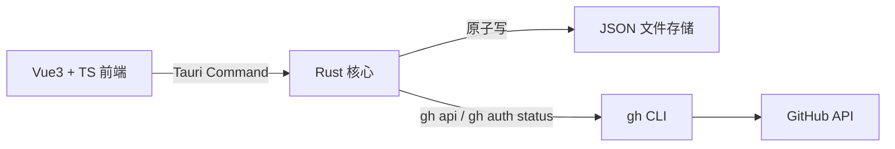

# MayDolist

> 面向开发者的 Windows 本地优先行动收件箱 —— 藏在屏幕角落的便签与 GitHub 追踪台。

MayDolist 是一款面向 Windows 开发者的**本地优先行动收件箱**：平时隐藏在屏幕角落与系统托盘，鼠标划过热角或按下全局快捷键即可呼出主面板，集 Todo 待办、桌面悬浮便签、按项目追踪的 GitHub PR / Issue、标签速记于一体。产品围绕「捕获 → 判断下一步 → 执行 → 回到来源」的闭环演进——快速收集降低捕获成本，Focus 今日视图聚合真正需要行动的内容，GitHub 来源关联保留开发上下文，本地数据与可导出备份建立长期信任。

## 功能特性

- **收纳式呼出**：鼠标滑到屏幕热角（默认右上角，可配置）或按全局快捷键（默认 `Ctrl+Alt+M`）呼出 / 隐藏主面板；系统托盘图标常驻。
- **快速收集**：默认 `Ctrl+Alt+Space`（可在设置中修改或关闭）呼出轻量收集窗口，输入即保存为 Todo（进入「收件箱」），前缀 `note:` 则创建便签；托盘菜单同样提供「快速收集」入口。
- **Focus 今日视图**：主面板默认打开「今日」，聚合未完成待办（收件箱优先）、置顶 / 最近更新便签与 GitHub 需要行动的条目，每个条目都提供最小快捷动作，数据读取按模块并行、局部失败不影响其他模块。
- **Todo 待办**：创建待办、勾选完成（划线展示）、软删除，支持多列表组织；条目可关联 GitHub 来源（PR / Issue），一键打开原文。
- **便签**：在主面板内快速记录，可拖出为独立桌面悬浮小窗（置顶、可收起）。
- **GitHub 追踪**：按项目（仓库）分组，可增删追踪仓库；展开查看未合并 PR 与「我的 / 被提及 / 被分配 / 参与」的 issue 与 PR；条目显示「需要我处理 / 需要 Review / CI 失败 / 长期未更新 / Draft」行动信号徽标与最后更新时间，并支持按信号过滤；点击条目在浏览器打开；PR / Issue 可一键「转为 Todo」进入收件箱并保留来源；本地缓存 + 手动（全部 / 单仓库）/ 定时刷新，单仓库失败不清空其他仓库，离线可查看缓存。
- **便签与标签**：便签支持标签、搜索、置顶与自动保存，可拖出为独立桌面悬浮小窗。
- **备份 / 导入 / 恢复**：一键「创建备份」（数据目录内保留最近 10 份时间戳备份）、导出数据包到任意位置、导入前预览内容并自动备份当前数据、打开数据目录；数据包不含任何登录凭据，导入校验失败不改动现有数据。
- **数据本地化**：所有数据保存在本机，存储路径可配置。

## 行动闭环

产品围绕「捕获 → 判断下一步 → 执行 → 回到来源」闭环组织：

| 阶段 | 做法 |
| --- | --- |
| 捕获 | 不打开主面板也能记录：全局快捷键 / 托盘呼出快速收集窗，`todo:` 或 `note:` 前缀即存；主面板内直接创建；GitHub PR / Issue 一键「转为 Todo」进入收件箱 |
| 判断下一步 | 打开主面板默认落在「今日」（Focus），聚合未完成待办（收件箱优先）、置顶 / 最近更新便签与需要行动的 GitHub 条目 |
| 执行 | 就地勾选完成 Todo、将便签拖出为悬浮小窗、进入对应模块继续处理 |
| 回到来源 | 带来源的 Todo 显示仓库徽标并一键打开 GitHub 原文，处理结果沉淀为下一步的新上下文 |

## 技术架构

- **Tauri 2（Rust 后端）**：负责窗口管理、文件读写与 gh 调用
- **Vue 3 + TypeScript + Vite（前端）**：主面板与悬浮便签界面
- **gh CLI**：GitHub 集成通道
- **JSON 文件存储**：文件夹形式的本地数据



所有文件读写与 gh 调用统一由 Rust 后端处理，前端不直接接触文件系统。

## 数据存储

默认数据目录：`%USERPROFILE%\Documents\MayDolist`（后续设置 UI 可配置）。

```text
MayDolist/
├── config.json              # 数据目录、呼出角、快捷键、主题、刷新间隔、stale 阈值、玻璃透明度
├── backups/                 # 时间戳命名的本地备份 ZIP（保留最近 10 份）
├── notes/<id>.json          # 便签：标题/内容/标签/颜色/置顶/窗口位置
├── todos/<id>.json          # 待办：多列表、完成与软删除状态
└── github/
    ├── watchlist.json       # 追踪仓库列表
    └── cache/               # PR / issue 快照缓存
```

写策略：全部经 Rust 单进程原子写（临时文件 + 重命名），多窗口并发安全。

领域模型保持向后兼容：新增字段一律可选（serde 默认值），旧数据按旧逻辑读取、无需迁移；存储格式演进由 `schemaVersion` 管理，备份 / 导出包由独立的 `packageSchemaVersion` 管理。

## 数据备份与恢复

设置页「数据安全」提供完整的本地数据安全能力：

- **创建备份**：立即在数据目录 `backups/` 下生成 `maydolist-backup-<时间戳>.zip`，自动只保留最近 10 份；「最近备份」列表展示时间、大小与位置。
- **导出数据**：选择任意目标位置保存 `maydolist-export-<时间戳>.zip`（数据包为 ZIP 格式，包含配置、待办、便签与 GitHub 追踪列表；默认附带可重建的 GitHub 快照缓存，可在导出前取消勾选）。
- **导入数据**：选择数据包后先显示内容概览（包格式版本、导出应用版本、便签 / 待办 / 缓存计数），确认后**自动备份当前数据**再执行导入；包损坏、版本过高或含非法路径时明确报错且不改动现有数据。
- **打开数据目录**：在系统资源管理器中打开当前数据目录，便于手动复制备份或排查。

数据包安全说明：

- 导出包**不含** gh token、认证文件、环境变量、日志或历史备份；可放心分享 / 归档。
- GitHub 快照缓存为可重建数据，恢复核心数据不依赖它；导入包中损坏的缓存文件会被跳过并提示，缺失缓存可在登录后通过「刷新 GitHub」重建。
- 导入采用「临时目录校验 → 备份当前数据 → 原子替换」流程，中途失败会自动回滚，不会产生半套数据。
- 恢复异常数据目录的完整操作：设置 → 数据目录 → 打开数据目录 → 将备份 ZIP 复制到其他位置（或直接使用「创建备份」产物）→ 需要时通过「导入数据」恢复。

## GitHub 集成设计

- 启动时通过 `gh auth status` 检测登录状态。
- 数据经 `gh api`（`--paginate`）读取 REST 接口获取 issue / PR 列表。
- 过滤维度：「我的」（author）、「被提及」（mentioned）、「被分配」（assignee）、「参与」（involved）的 issue 与 PR，以及未合并 PR。
- 行动信号：每个仓库可叠加「需要我处理 / 需要 Review / CI 失败 / 长期未更新」过滤（默认不启用，保持旧列表行为）；「Draft」仅作展示徽标。条目显示稳定信号徽标、最后更新时间和本地快照 / 信号计算时间。
- 展示本地缓存：刷新失败或离线时展示上次快照并提示刷新失败；API 缺信号字段的旧快照标注「旧缓存」，刷新后自动补全。
- 刷新策略：全部刷新按仓库串行执行，同一仓库并发刷新去重（重复点击 / 定时器不会启动两个任务）；单仓库失败只标记该仓库，不清空其他仓库数据。
- 点击条目在系统浏览器打开对应页面。

## 非目标

- 不做云同步、多端同步、移动端或 Web 端；数据只存本机。
- 不在应用内嵌入 GitHub 登录，也不读取 / 存储 GitHub token（登录统一走 `gh auth login`，凭据由 gh CLI 持有）。
- 不把本地 JSON 存储整体迁移到数据库；领域模型与文件格式保持向后兼容。
- 不做完整的 GitHub 管理能力（创建 / 合并 PR、评论等），只做只读追踪与跳转浏览器。

## Focus 今日视图

主面板默认打开「今日」（Focus）Tab，作为 Todo / 便签 / GitHub 的只读聚合入口，不改变任何领域数据的文件格式。

纳入与排序规则：

- **待办**：只纳入未完成（且未软删除）的条目；「收件箱」（`kind=inbox`）优先，其余按清单与条目原有顺序排列。上限 50 条，超出提示「进入待办查看」。
- **便签**：置顶便签全部纳入（按更新时间倒序），随后补最近更新的未置顶便签（默认 5 条，按 id 去重），总上限 8 条；条目显示首行内容预览。
- **GitHub**：只纳入本地快照中 state 为 open 且携带可行动信号（需要我处理 / 需要 Review / CI 失败 / 长期未更新）的 Issue / PR（不发起网络请求；仅 Draft 或无关条目不进入 Focus）；手动钉住（📌）的条目优先，其余按更新时间倒序，上限 30 条。未登录、离线或上次刷新失败时展示本地缓存并提示「离线 / 未登录」。

最小动作：

- 待办条目可直接勾选完成；勾选后经 `entity-changed` 事件自动刷新 Focus。
- 便签条目点击进入便签模块并打开该便签编辑，也可直接「悬浮」为桌面小窗。
- GitHub 条目点击在系统浏览器打开原文，也可一键进入 GitHub 模块。

状态处理：首屏加载中显示加载态；单个模块读取失败只在该模块显示局部错误，其余模块正常；整体 IPC 失败时保留上次内容并提示。多窗口（如悬浮便签）修改数据后，Focus 通过 `entity-changed` 事件自动刷新，与其他 Tab 保持一致。

## 开发环境与构建

环境要求（Windows）：

- Rust（通过 rustup 安装）
- Node.js 22+ 与 pnpm
- WebView2 Runtime（玻璃效果与视觉基线仅针对 Windows 11 + WebView2 校准）

```powershell
pnpm install
pnpm tauri dev        # 开发模式
pnpm tauri build      # 构建便携 exe
```

构建产物为单文件便携 exe（前端资源内嵌，依赖系统 WebView2），免安装直接运行。

## 项目结构

正式应用代码位于仓库根目录，按 [docs/architecture.md](docs/architecture.md) 的模块边界组织：

```text
src/                  # Vue 3 + TS 前端
  api/                # invoke 唯一入口与错误归一化
  stores/             # Pinia 状态（settings / focus / todo / note / github）
  views/              # 主面板（Focus / Todo / 便签 / GitHub / 设置）、悬浮便签与快速收集
  types/              # 与 Rust models 对应的 TS 类型
src-tauri/src/        # Rust 后端
  commands/           # Tauri 命令（真实接口）
  services/           # 真实持久化领域服务与 gh CLI 客户端
  models/             # serde 数据模型
  storage/            # 数据目录解析 + 原子写 + config 读写（真实）
  events/             # 事件广播（data-changed）
```

v1.0 中 Todo 与便签均使用本地 JSON 原子持久化；标签速记已合并到统一便签模型。系统托盘、全局热键、多显示器热角、悬浮便签、真实 gh CLI、数据迁移与开机自启均由 Rust 系统层提供。

## v1.0 已实现

- Todo 多列表、排序、跨列表移动、软删除与回收站。
- 统一便签、标签搜索、置顶、自动保存与独立悬浮窗口。
- GitHub CLI 仓库追踪、身份筛选、磁盘缓存与后台刷新。
- 托盘、热键、多显示器热角、主题、数据迁移与开机自启。
- NSIS 安装器与便携版发布流程，详见 [构建文档](docs/building.md)。

## 架构决策记录（ADR）

### ADR-001：UI 技术栈选型（已定稿）

2026-08-04 在 `prototypes/` 下构建了三个最小毛玻璃原型（已 gitignore，不入库），统一呈现「Win11 Acrylic 磨砂玻璃 + 半透明圆角深色卡片」，用于肉眼对比质感与开发手感：

| 原型 | 技术栈 | Windows 磨砂方案 | 产物 |
| --- | --- | --- | --- |
| tauri-vue | Tauri 2 + Vue 3 + TS | 原生 `windowEffects: acrylic`，无需手写 DWM | `prototypes/tauri-vue/src-tauri/target/debug/prototypestauri-vue.exe` |
| slint-app | Slint 1.17 + Rust | 取 HWND 后 `DwmSetWindowAttribute`（SYSTEMBACKDROP=3） | `prototypes/slint-app/target/debug/slint-app.exe` |
| iced-app | Iced 0.14 + Rust | 后台线程按标题找 HWND 后开 Acrylic（iced 自带 blur 仅 macOS/Linux 生效） | `prototypes/iced-app/target/debug/iced-app.exe` |

**结论：采用 Tauri 2 + Vue 3 + TypeScript + Rust 后端 + gh CLI。**

决策理由：

- Tauri 原生支持 Windows Acrylic 磨砂效果（`windowEffects`），无需手写 DWM 调用。
- Vue 3 + TS 负责全部界面，Rust 负责窗口、托盘、热键、原子写盘与 gh 调用，分工清晰。
- 多窗口（主面板 + 悬浮便签）与 WebView2 调试成本低，生态成熟。
- 拒绝 Slint / Iced：纯 Rust UI 在多窗口、动态列表与迭代速度上成本更高，毛玻璃需额外手写 DWM。

整体架构见 [docs/architecture.md](docs/architecture.md)。

## License

[MIT](LICENSE)
