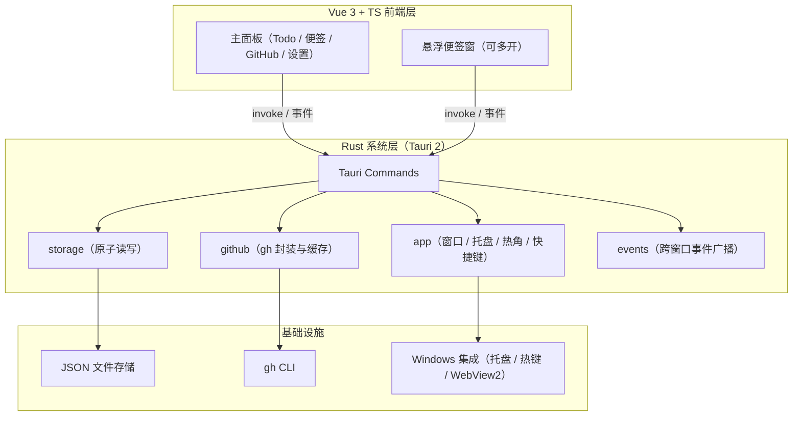
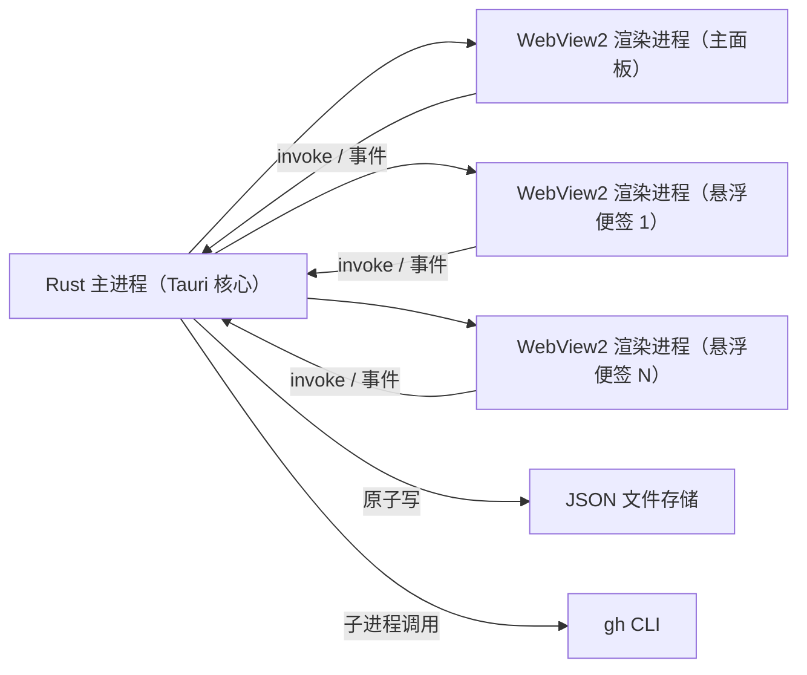
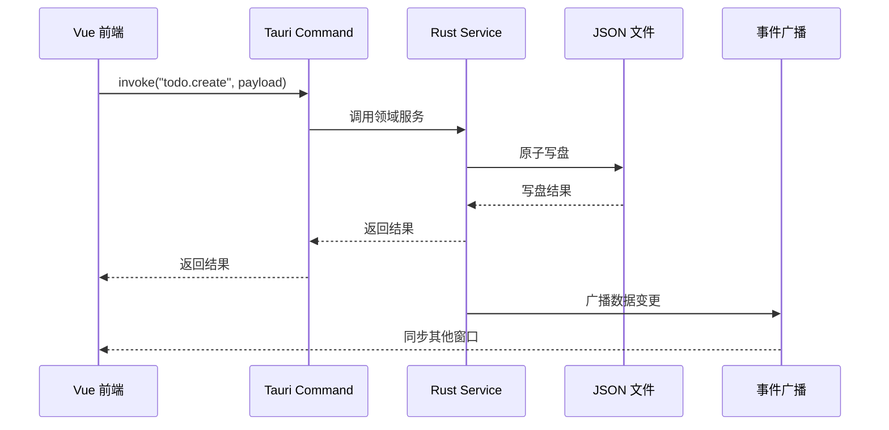

# MayDolist 架构文档

> 状态：设计基线 · 最后更新：2026-08-04

本文档描述 MayDolist 的系统架构与关键设计决策，作为后续实现与迭代的设计基线。文档只做设计陈述，不包含实现代码；实际实现以其为准，如需调整设计，请先更新本文档并记录 ADR。

## 1. 背景与目标

MayDolist 是一款面向 Windows 的「收纳式」桌面便签应用，平时隐藏在屏幕角落与系统托盘，鼠标划过热角或按全局快捷键即可呼出主面板，集 Todo 待办、桌面悬浮便签、按项目追踪的 GitHub PR / Issue、标签速记于一体。

### 1.1 产品目标

- 提供一个随时可唤出的主面板，收纳待办、便签、GitHub 进度与速记。
- 便签可拖出为独立桌面悬浮小窗（置顶、可收起），贴近系统原生体验。
- GitHub 追踪按项目（仓库）分组，展示未合并 PR 与「我的 / 被提及 / 被分配 / 参与」的 issue 与 PR。
- 所有数据保存在本机，数据目录可配置，离线可查看缓存。

### 1.2 目标用户

- Windows 桌面用户（Windows 10+，依赖 WebView2）。
- 日常使用 GitHub、希望在工作流中快速跟进 PR / issue 的开发者。
- 偏好本地优先、不依赖云账号的轻量效率工具用户。

### 1.3 非目标（明确不做）

- 不做云同步与多端同步（数据仅存本机）。
- 不做移动端 / Web 端。
- 不在应用内嵌浏览器登录 GitHub（登录统一走 `gh auth login`，由 gh CLI 持有凭据）。
- 不做完整的 GitHub 管理能力（不创建 PR、不合并、不评论），只做只读追踪与跳转浏览器。

## 2. 现状与边界

### 2.1 当前状态

- 正式实现骨架已落地：仓库根目录为 Tauri 2 + Vue 3 + TS 项目（`src/` 前端与 `src-tauri/` 后端）。
- v1.0 已实现真实业务：`todo` / `note` / `github` 均为 JSON 原子持久化与真实 gh 调用；托盘、全局热键、多显示器热角、悬浮便签、数据迁移与开机自启均已落地。
- `prototypes/` 下有三个最小毛玻璃原型（Tauri + Vue、Slint、Iced），仅用于肉眼对比质感与开发手感，已 gitignore，不入库。
- 本文档为正式实现提供设计基线，骨架实现与之保持模块边界一致。

### 2.2 系统边界

| 边界 | 说明 |
| --- | --- |
| 运行平台 | 单机 Windows（Windows 10+，依赖系统 WebView2） |
| 数据存储 | 本地 JSON 文件，目录可配置 |
| GitHub 通道 | 唯一通道为 gh CLI（`gh api` / `gh auth status`） |
| 网络 | 仅 GitHub API 访问；离线时回退本地缓存 |
| 凭据 | GitHub 凭据仅由 gh CLI 持有，应用不读取、不存储 token |

## 3. 总体架构

### 3.1 技术栈

- **UI 层**：Vue 3 + TypeScript（全部界面由 Vue 承担）。
- **构建 / 开发工具链**：Vite（开发热更新与生产打包），由 Tauri 前端脚手架标准提供。
- **系统层**：Rust（Tauri 2 后端），负责窗口、托盘、热键、热角、原子写盘与 gh 调用。
- **进程模型**：1 个 Rust 主进程 + N 个 WebView2 渲染进程（主面板与每个悬浮便签窗各一个渲染进程）。

### 3.2 分层架构



### 3.3 进程模型



### 3.4 数据流

所有数据访问遵循固定方向：**UI → invoke → Command → Service → 原子写盘 → 事件广播回所有窗口**。



## 4. 模块边界

### 4.1 Rust 系统层

| 模块 | 职责 | 不负责 |
| --- | --- | --- |
| `app` | 窗口创建与管理、托盘、热角、全局快捷键 | 业务数据读写 |
| `commands` | 暴露给前端的 Tauri Commands，做参数校验与错误转换 | 业务规则 |
| `storage` | 数据目录解析、JSON 序列化 / 反序列化、原子写盘 | GitHub 数据获取 |
| `github` | gh 子进程调用、响应解析、缓存读写、定时刷新 | UI 展示 |
| `models` | serde 数据模型（config / note / todo / github） | 任何 IO |
| `events` | 跨窗口事件广播（数据变更、窗口状态） | 业务逻辑 |

### 4.2 Vue 前端层

| 模块 | 职责 |
| --- | --- |
| `views` | 主面板视图（Todo / 便签 / GitHub / 设置）与悬浮便签窗 |
| `stores` | Pinia 状态管理，维护 UI 状态与缓存数据 |
| `api` | `invoke` 封装层，前端唯一的数据访问入口 |
| `components` | 可复用 UI 组件（卡片、列表、标签、窗口控制等） |
| `types` | 与 Rust `models` 对应的 TypeScript 类型 |

前端不直接接触文件系统；所有文件读写与 gh 调用统一由 Rust 后端处理。

## 5. 数据模型与存储

### 5.1 存储布局

默认数据目录：`%USERPROFILE%\Documents\MayDolist`（后续设置 UI 可配置）。

```text
MayDolist/
├── config.json              # 数据目录、呼出角、快捷键、主题、刷新间隔
├── notes/<id>.json          # 便签：标题/内容/标签/颜色/置顶/窗口位置
├── todos/<id>.json          # 待办：每个文件一个列表，条目含完成与软删除状态
└── github/
    ├── watchlist.json       # 追踪仓库列表
    └── cache/<repo>.json    # PR / issue 快照缓存，含 fetchedAt
```

### 5.2 实体规则

- 实体一文件，文件名 = UUID，扩展名 `.json`。
- 每个实体文件均含 `schemaVersion` 字段，用于未来格式迁移。
- `todos/<id>.json` 为一个列表（多列表组织），条目含 `completed` 与 `deleted`（软删除）状态。
- `github/cache/<repo>.json` 为仓库快照，含 `fetchedAt` 时间戳，刷新失败或离线时回退展示。
- `config.json` 为单例配置，不采用实体文件形式。

### 5.3 写入策略

- 全部写入走**单进程原子写**：临时文件 + 重命名，避免写一半损坏。
- Rust 单写者（Mutex 串行化写盘），多窗口并发安全。
- 先写盘，成功后广播数据变更事件。

## 6. 关键流程

### 6.1 启动与登录检测

1. 启动 Rust 主进程，加载 `config.json`，创建缺失目录。
2. 创建主面板窗口（隐藏）、托盘图标，注册热角与全局快捷键。
3. 前端加载后调用登录检测：`gh auth status` 判断登录状态。
4. 未登录时提示引导 `gh auth login`；已登录则按配置触发 GitHub 数据刷新。

### 6.2 呼出 / 隐藏

- 默认热角：右上角；默认全局快捷键：`Ctrl+Alt+M`。
- 托盘图标常驻，点击切换主面板显示 / 隐藏。
- 主面板隐藏时不退出进程，保持托盘与后台刷新能力。

### 6.3 Todo

- 创建待办、勾选完成（划线展示）、软删除，支持多列表组织。
- 软删除数据保留在文件内，便于未来恢复；列表展示时过滤已删除项。

### 6.4 便签

- 主面板内快速记录，可拖出为独立桌面悬浮小窗（置顶、可收起）。
- 每个悬浮便签窗对应一个 Rust 窗口与一个 WebView2 渲染进程；关闭悬浮窗只隐藏不销毁数据。

### 6.5 GitHub 追踪

- 按项目（仓库）分组，可增删追踪仓库。
- 展示未合并 PR 与「我的 / 被提及 / 被分配 / 参与」的 issue 与 PR。
- 数据经 `gh api`（`--paginate`）读取 REST 接口获取。
- 手动刷新 + 定时刷新（默认 30 分钟，可配置）。
- 刷新失败或离线时，展示上次本地快照并提示「刷新失败」。
- 点击条目在系统浏览器打开对应页面。

## 7. 并发与一致性

- **单写者**：所有文件写入由 Rust 单进程串行化（Mutex），避免多窗口并发写冲突。
- **先写盘后广播**：写盘成功后才广播数据变更事件，前端收到的状态与磁盘一致。
- **缓存与实体分离**：GitHub 缓存（`github/cache/`）与用户实体数据（`notes/`、`todos/`）分离，缓存可安全重建。
- **多窗口同步**：通过 Tauri 事件广播数据变更，所有窗口（主面板与悬浮便签）保持同一数据视图。

## 8. 安全与权限

- **Tauri capabilities 最小化授权**：只授予前端必需能力，前端无文件系统访问权限。
- **GitHub 凭据**：仅由 gh CLI 持有，应用不读取、不存储 token。
- **外链一律系统浏览器打开**：不内嵌浏览器，降低凭据与 XSS 暴露面。
- **默认 CSP**：为前端页面设置合理 CSP，禁止不安全的内联执行与外部资源加载。

## 9. 错误处理与恢复

| 场景 | 处理方式 |
| --- | --- |
| gh 认证失效 / 未登录 | 提示引导 `gh auth login`，保留本地缓存可看 |
| 网络失败 / 离线 | 展示上次缓存快照并提示「刷新失败」 |
| JSON 文件损坏 | 隔离损坏文件（备份后重建），避免整个数据目录不可用 |
| 写盘失败（磁盘满 / 权限） | 保留原文件不覆盖，向 UI 返回错误并记录日志 |
| 本地日志 | 记录关键错误（写入、gh 调用、窗口创建），便于排查 |

## 10. 验收标准

### 10.1 正常路径

- 首次启动自动创建数据目录与默认 `config.json`。
- Todo / 便签 / 速记 / 追踪仓库的增删改查全部走 Rust 原子写，重启后数据完整。
- 热角、全局快捷键、托盘均可呼出 / 隐藏主面板。
- 便签可拖出为独立悬浮小窗（置顶、可收起），数据与主面板一致。
- GitHub 手动刷新与定时刷新成功，条目按仓库分组展示，点击在系统浏览器打开。

### 10.2 异常路径

- 断网或 `gh api` 失败：展示缓存并提示「刷新失败」，不崩溃、不丢数据。
- `gh auth status` 未登录 / token 失效：提示引导登录，缓存仍可查看。
- 单个 JSON 损坏：隔离并重建该文件，其余数据不受影响。

### 10.3 恢复路径

- 修复登录 / 网络后，手动刷新成功恢复实时数据。
- 损坏文件修复后重启应用，数据目录整体可读。
- 多窗口并发操作后，所有窗口数据一致，无丢失。

## 11. 落地清单与风险

### 11.1 落地清单（对照 roadmap）

| 阶段 | 范围 | 对应模块 |
| --- | --- | --- |
| v0.1 | Todo 待办 + 收纳式呼出（热角 / 快捷键 / 托盘） | `app`、`storage`、`models`、前端 Todo 视图 |
| v0.2 | GitHub 项目追踪（增删仓库、PR / issue 展示、缓存刷新） | `github`、`storage`、前端 GitHub 视图 |
| v0.3 | 独立悬浮便签窗 + 标签速记 | `app`（多窗口）、`storage`、前端便签 / 速记视图 |
| v1.0 | 设置 UI、开机自启、NSIS 安装包 | `app`、`config`、打包配置 |

### 11.2 风险与回滚

| 风险 | 影响 | 缓解 |
| --- | --- | --- |
| 目标机器无 WebView2 | 应用无法启动 | 安装包检测并提示安装 WebView2 Runtime |
| gh CLI 版本差异 | `gh api` 输出字段不一致 | 解析时容错缺失字段，版本检测提示升级 |
| 数据格式未来迁移 | 旧数据无法读取 | 实体文件含 `schemaVersion`，升级时迁移 |
| 多窗口状态漂移 | 主面板与悬浮窗数据不一致 | 统一事件广播 + 单写者，验收含并发一致性 |

## 12. 相关文档

- [README](../README.md)：产品概览、开发环境与构建。
- ADR-001（README 内）：UI 技术栈选型（已定稿：Tauri 2 + Vue 3 + TS + Rust 后端 + gh CLI）。
