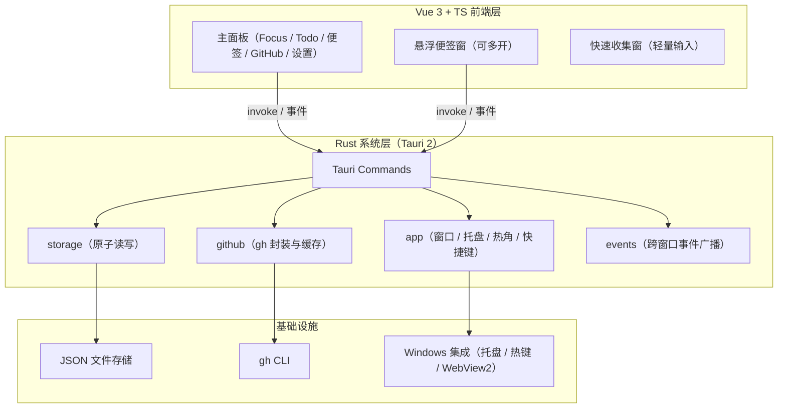
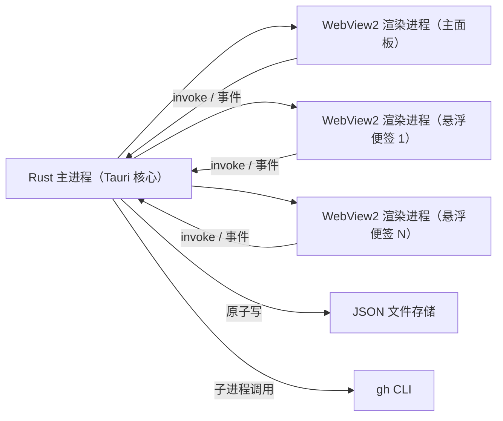
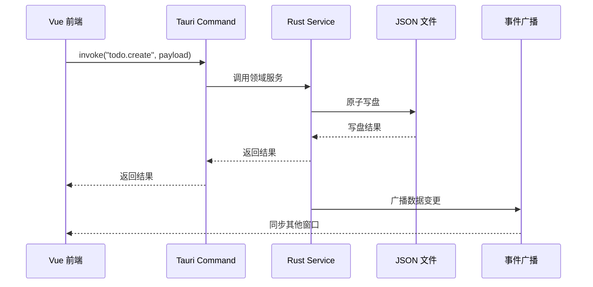
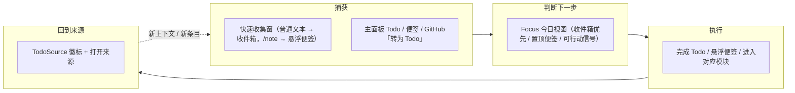

# MayDolist 架构文档

> 状态：设计基线 · 最后更新：2026-08-12

本文档描述 MayDolist 的系统架构与关键设计决策，作为后续实现与迭代的设计基线。文档只做设计陈述，不包含实现代码；实际实现以其为准，如需调整设计，请先更新本文档并记录 ADR。

## 1. 背景与目标

MayDolist 是一款面向 Windows 的**本地优先开发者行动收件箱**。它平时隐藏在屏幕角落与系统托盘，鼠标划过热角或按全局快捷键即可呼出主面板，集 Todo 待办、桌面悬浮便签、按项目追踪的 GitHub PR / Issue、标签速记于一体；产品围绕「捕获 → 判断下一步 → 执行 → 回到来源」的闭环演进，让待办、笔记与开发进度都收纳在一个随时可唤出的面板里。

### 1.1 产品定位

- **形态**：Windows 桌面优先的轻量行动收件箱，可随时收起（热角 / 托盘 / 全局快捷键），数据只存本机。
- **对象**：日常使用 GitHub、希望在开发工作流中快速跟进 PR / issue 的开发者。
- **价值**：用快速收集降低捕获成本，用 Focus / 今日视图聚合真正需要行动的内容，用 GitHub 来源关联保留开发上下文，用本地数据与可导出备份建立长期信任。

### 1.2 产品目标

- 提供一个随时可唤出的主面板，收纳待办、便签、GitHub 进度与速记。
- 便签可拖出为独立桌面悬浮小窗（置顶、可收起），贴近系统原生体验。
- GitHub 追踪按项目（仓库）分组并可折叠；默认展示过滤器命中的 PR / Issue，支持忽略与 `#xx` 手动钉住。
- 所有数据保存在本机，数据目录可配置，离线可查看缓存。

### 1.3 目标用户

- Windows 桌面用户（Windows 10+，依赖 WebView2）。
- 日常使用 GitHub、希望在工作流中快速跟进 PR / issue 的开发者。
- 偏好本地优先、不依赖云账号的轻量效率工具用户。

### 1.4 非目标（明确不做）

- 不引入云同步与多端同步（数据仅存本机，不做移动端 / Web 端）。
- 不在应用内嵌入 GitHub 登录，也不读取 / 存储 GitHub token（登录统一走 `gh auth login`，凭据由 gh CLI 持有）。
- 不把本地 JSON 存储整体迁移到数据库；现有领域模型与字段保持向后兼容，新增字段一律可选 + serde 默认值。
- 不做完整的 GitHub 管理能力（不创建 PR、不合并、不评论），只做只读追踪与跳转浏览器。
- 不变成完整项目管理工具，不引入复杂依赖、里程碑或团队协作。

### 1.5 设计原则

1. 保持 Windows 桌面优先、轻量、可随时收起的体验。
2. 保持本地优先，不引入云同步、移动端或内嵌 GitHub 登录。
3. Todo、Note、GitHub 保留各自领域模型；跨模块通过可选来源引用（`TodoSource`）和只读聚合投影（Focus）连接，不互相耦合写路径。
4. 所有新数据字段必须向后兼容：serde 默认值 + `schemaVersion` / `packageSchemaVersion` 迁移，旧数据按旧逻辑读取。
5. 每个阶段都必须有可验证的正常、边界和异常路径（见 §10 验收标准与各轮单元测试）。

## 2. 现状与边界

### 2.1 当前状态

- 正式实现骨架已落地：仓库根目录为 Tauri 2 + Vue 3 + TS 项目（`src/` 前端与 `src-tauri/` 后端）。
- v1.0 已实现真实业务：`todo` / `note` / `github` 均为 JSON 原子持久化与真实 gh 调用；托盘、全局热键、多显示器热角、悬浮便签、数据迁移与开机自启均已落地。
- `prototypes/` 下有三个最小毛玻璃原型（Tauri + Vue、Slint、Iced），仅用于肉眼对比质感与开发手感，已 gitignore，不入库。
- 本文档为正式实现提供设计基线，骨架实现与之保持模块边界一致。

### 2.2 系统边界

| 边界 | 说明 |
| --- | --- |
| 运行平台 | 单机 Windows（Windows 10+，依赖系统 WebView2） |
| 数据存储 | 本地 JSON 文件，目录可配置 |
| GitHub 通道 | 唯一通道为 gh CLI（`gh api` / `gh auth status`） |
| 网络 | 仅 GitHub API 访问；离线时回退本地缓存 |
| 凭据 | GitHub 凭据仅由 gh CLI 持有，应用不读取、不存储 token |

## 3. 总体架构

### 3.1 技术栈

- **UI 层**：Vue 3 + TypeScript（全部界面由 Vue 承担）。
- **构建 / 开发工具链**：Vite（开发热更新与生产打包），由 Tauri 前端脚手架标准提供。
- **系统层**：Rust（Tauri 2 后端），负责窗口、托盘、热键、热角、原子写盘与 gh 调用。
- **进程模型**：1 个 Rust 主进程 + N 个 WebView2 渲染进程（主面板与每个悬浮便签窗各一个渲染进程）。

### 3.2 分层架构



### 3.3 进程模型



### 3.4 数据流

所有数据访问遵循固定方向：**UI → invoke → Command → Service → 原子写盘 → 事件广播回所有窗口**。



### 3.5 产品闭环与模块关系

产品按「捕获 → 判断下一步 → 执行 → 回到来源」闭环组织，各阶段由既有模块协作完成，不新增独立领域：



| 阶段 | 入口 / 模块 | 说明 |
| --- | --- | --- |
| 捕获 | `quick_capture`（快速收集窗）、`todo` / `note` 服务、GitHub 视图「转为 Todo」 | 不打开主面板也能记录；GitHub 条目一键带来源进入收件箱 |
| 判断下一步 | `focus` 服务 + FocusView | 只读聚合未完成 Todo（收件箱优先）、置顶 / 最近便签、带可行动信号的 GitHub 条目 |
| 执行 | Todo 完成、悬浮便签、打开来源 | 最小动作就地完成或跳转 |
| 回到来源 | `TodoSource`（type / repo / number / url） | Todo 携带来源，可一键返回 GitHub 原文，形成闭环 |

模块关系要点：

| 关系 | 说明 |
| --- | --- |
| `commands` → `services` | 前端唯一入口：参数校验 / 错误转换后调用领域服务 |
| `services` → `storage` | 领域服务持写锁，经 `storage` 原子写盘 |
| `services` → `github` | gh CLI 封装与缓存，供 GitHub 服务与快照刷新使用 |
| `focus` → todo / note / github | 只读投影，并行加载 + 局部失败隔离，不产生写路径 |
| GitHub → Todo（单向） | 经 `todo_create_from_github` 转换，GitHub 侧缓存、认证与网络状态不变 |
| `events` → 所有窗口 | 数据变更广播，保证主面板与悬浮窗一致 |

## 4. 模块边界

### 4.1 Rust 系统层

| 模块 | 职责 | 不负责 |
| --- | --- | --- |
| `app` | 窗口创建与管理、托盘、热角、全局快捷键 | 业务数据读写 |
| `commands` | 暴露给前端的 Tauri Commands，做参数校验与错误转换 | 业务规则 |
| `storage` | 数据目录解析、JSON 序列化 / 反序列化、原子写盘 | GitHub 数据获取 |
| `backup` | 数据包导出 / 导入校验 / 备份轮转 / 恢复（临时目录校验 + 原子替换） | UI 展示 |
| `github` | gh 子进程调用、响应解析、缓存读写、定时刷新 | UI 展示 |
| `focus` | 跨领域只读投影：并行加载、局部失败隔离、排序 / 去重 / 截断 | 任何写操作 |
| `models` | serde 数据模型（config / note / todo / github） | 任何 IO |
| `events` | 跨窗口事件广播（数据变更、窗口状态） | 业务逻辑 |

### 4.2 Vue 前端层

| 模块 | 职责 |
| --- | --- |
| `views` | 主面板视图（Focus / Todo / 便签 / GitHub / 设置）、悬浮便签窗与快速收集窗 |
| `stores` | Pinia 状态管理，维护 UI 状态与缓存数据 |
| `api` | `invoke` 封装层，前端唯一的数据访问入口 |
| `components` | 可复用 UI 组件（卡片、列表、标签、窗口控制等） |
| `types` | 与 Rust `models` 对应的 TypeScript 类型 |

前端不直接接触文件系统；所有文件读写与 gh 调用统一由 Rust 后端处理。

## 5. 数据模型与存储

### 5.1 存储布局

默认数据目录：`%USERPROFILE%\Documents\MayDolist`（后续设置 UI 可配置）。

```text
MayDolist/
├── config.json              # 数据目录、呼出角、快捷键、主题、刷新间隔、玻璃透明度
├── backups/                 # 时间戳命名的本地备份 ZIP（保留最近 10 份）
├── notes/<id>.json          # 便签：标题/内容/标签/颜色/置顶/窗口位置
├── todos/<id>.json          # 待办：每个文件一个列表，条目含完成与软删除状态；系统列表用 kind 标记
└── github/
    ├── watchlist.json       # 追踪仓库：filters / signalFilters / collapsed / ignored / pinned
    └── cache/<repo>.json    # PR / issue 快照缓存，含 fetchedAt / signalsComputedAt（可重建）
```

### 5.2 实体规则

- 实体一文件，文件名 = UUID，扩展名 `.json`。
- 每个实体文件均含 `schemaVersion` 字段，用于未来格式迁移。
- `todos/<id>.json` 为一个列表（多列表组织），条目含 `completed` 与 `deleted`（软删除）状态。
- Todo 条目可携带可选来源引用 `source`（`type` / `repo` / `number` / `url`，MVP 支持 `github-issue` / `github-pr`）；旧数据无该字段时按无来源读取，序列化时缺省字段不落盘，向后兼容。
- `github/cache/<repo>.json` 为仓库快照，含 `fetchedAt` 时间戳，刷新失败或离线时回退展示。
- 仓库快照的每个条目含可选信号字段（`assignees` / `reviewers` / `headSha` / `checksState` / `signals`），快照级 `signalsComputedAt` 记录信号计算时间；旧快照缺字段时按空值读取，刷新成功后自动补全（向后兼容，不需要迁移）。
- 行动信号是稳定枚举（`needsAction` / `needsReview` / `ciFailed` / `stale` / `draft`），UI 只消费该枚举，不依赖 GitHub 原始字符串；`stale` 依据 `config.json` 的 `githubStaleDays`（默认 14 天，0 关闭）在读取快照时实时计算。
- `config.json` 为单例配置，不采用实体文件形式。
- 系统列表（如快速收集的「收件箱」）通过 `kind` 字段标记（`kind=inbox`）；旧数据无该字段时按普通列表读取，兼容不破坏。

### 5.3 写入策略

- 全部写入走**单进程原子写**：临时文件 + 重命名，避免写一半损坏。
- Rust 单写者（Mutex 串行化写盘），多窗口并发安全。
- 先写盘，成功后广播数据变更事件。

### 5.4 配置与玻璃透明度

`config.json` 使用 `schemaVersion` 管理结构演进。玻璃透明度相关配置键：

- `mainWindowGlassOpacity`：主面板玻璃背景层 alpha，范围 `0.4..=1.0`。
- `floatingNoteGlassOpacity`：悬浮便签玻璃背景层 alpha，范围 `0.4..=1.0`。
- `quickCaptureHotkey` / `quickCaptureEnabled`：快速收集窗的全局快捷键与启用开关，默认 `Ctrl+Alt+Space` / `true`；与主面板快捷键冲突或格式非法时在保存设置时报错，不写入。

相关规则：

- **支持环境基线**：当前 Windows 11 + WebView2 是唯一受支持环境。玻璃效果只针对该环境渲染，不维护 Windows 10、旧版 WebView2 或缺失 Acrylic 能力环境的降级路径。
- **兼容 schema 升级**：新增配置字段提供 serde 默认值。加载旧 `config.json` 时保留原主题、快捷键、热角和数据目录，补齐新字段、升级 `schemaVersion` 并回写；只有 JSON 损坏或结构不可恢复时才隔离备份。
- **范围校验与容错**：`settings_update` 拒绝写入越界透明度；加载时对越界值做 clamp（`0.4..=1.0`）并回写，容忍手工编辑导致的错误值。
- **多窗口应用**：主面板与每个悬浮便签窗读取对应透明度配置，通过 `settings-changed` 事件广播同步。

### 5.5 数据包（导出 / 备份）格式

导出与「创建备份」产物为同一 ZIP 包格式，包内布局如下：

```text
maydolist-export-YYYYMMDD-HHMMSS.zip
├── manifest.json            # packageSchemaVersion / appVersion / createdAt / tool / summary
├── config.json              # 完整配置（导入时 dataDir 会被改写为当前数据目录）
├── notes/<id>.json          # 便签（原样文件）
├── todos/<id>.json          # 待办列表（原样文件）
└── github/
    ├── watchlist.json       # 追踪列表（filters / signalFilters / ignored / pinned）
    └── cache/<repo>.json    # 可重建快照缓存（导出可选，恢复不依赖）
```

- 包格式用独立 `packageSchemaVersion`（当前 `1`）管理，不直接复用单文件 `schemaVersion`；未来格式变化通过版本号 + 迁移函数演进。
- 导出包包含 config、Todo、Note、GitHub watchlist 与（可选）GitHub cache；**不包含** `logs/`、`backups/`、gh token、认证文件或任何环境变量。
- 导入前在临时 / 同卷 staging 目录完成校验：manifest 版本兼容、路径安全（拒绝绝对路径、`..` 穿越、反斜杠变体、驱动器符）、重复条目、核心 JSON 可解析；校验失败不修改当前数据。
- 可重建的 `github/cache` 为降级数据：单文件损坏时跳过并计数提示，不影响核心恢复；缺失 cache 恢复后仍可通过 gh CLI 刷新。
- 「创建备份」写入 `<数据目录>/backups/maydolist-backup-<时间戳>.zip` 并轮转保留最近 10 份；导入前自动创建当前数据的完整备份，导入失败时原数据仍可通过该备份恢复。

## 6. 关键流程

### 6.1 启动与登录检测

1. 启动 Rust 主进程，加载 `config.json`，创建缺失目录。
2. 创建主面板窗口（隐藏）、托盘图标，注册热角与全局快捷键。
3. 前端加载后调用登录检测：`gh auth status` 判断登录状态。
4. 未登录时提示引导 `gh auth login`；已登录则按配置触发 GitHub 数据刷新。

### 6.2 呼出 / 隐藏

- 默认热角：右上角；默认全局快捷键：`Ctrl+Alt+M`。
- 托盘图标常驻，点击切换主面板显示 / 隐藏。
- 主面板隐藏时不退出进程，保持托盘与后台刷新能力。
- 快速收集：默认 `Ctrl+Alt+Space`（或托盘「快速收集」）呼出轻量窗口；再次按快捷键、Esc、右上角关闭按钮或 Alt+F4 可隐藏；输入默认创建 Todo 到「收件箱」，单独输入 `/note` 创建并打开空白悬浮便签；Enter 成功后隐藏并清空，手动隐藏保留草稿，失败时保留输入并显示错误。
- 「收件箱」为系统列表：优先按 `kind=inbox` 稳定标记查找，其次采用同名（「收件箱」）旧列表并补记标记，均不存在时才创建，保证幂等不重复。

### 6.3 Todo

- 创建待办、勾选完成（划线展示）、软删除，支持多列表组织。
- 软删除数据保留在文件内，便于未来恢复；列表展示时过滤已删除项。
- 条目可带来源引用（如 GitHub PR / Issue）：Todo 视图与 Focus 视图显示来源徽标（仓库 #编号），并提供「打开来源」操作；来源 URL 仅允许 http / https，由 Rust 层校验，打开统一走系统浏览器。
- 来源字段必须通过 Rust command / service 传递并持久化，前端不直接写文件。

### 6.4 便签

- 主面板内快速记录，可拖出为独立桌面悬浮小窗（置顶、可收起）。
- 每个悬浮便签窗对应一个 Rust 窗口与一个 WebView2 渲染进程；关闭悬浮窗只隐藏不销毁数据。

### 6.5 GitHub 追踪

- 按项目（仓库）分组，可增删追踪仓库；仓库面板支持折叠 / 展开，并持久化折叠状态与条目摘要（如 `3 PR · 2 Issue`）。
- 默认只展示过滤器命中的 open Issue / PR（「我的 / 被提及 / 被分配 / 参与」）；可选开启「全部 PR」以拉取仓库全部未合并 PR。
- 行动信号：每条 open 条目计算稳定信号并显示徽标——「需要我处理」（被分配 / 被提及 / 参与 / 手动关注）、「需要 Review」（当前用户被请求 review 的 PR）、「CI 失败」（失败 / 错误检查）、「长期未更新」（超过 `githubStaleDays` 天）、「Draft」（草稿 PR，仅展示不计入行动）。每条目同时显示最后更新时间和本地快照 / 信号计算时间。
- 行动信号过滤：每个仓库可选按信号过滤（多选，空 = 不过滤，保持旧行为）；「Draft」不提供过滤选项，避免把信息性状态变成行动列表。
- 支持忽略条目：忽略名单写在 `github/watchlist.json`（非可重建 cache），刷新后仍保持隐藏；可用 `#xx` 手动加回。
- 支持按仓库手动钉住：在展开的仓库内输入 `#123`，经 `gh api repos/{repo}/issues/{n}` 拉取后写入 `pinned`，与自动结果合并展示（标记「手动」）。
- 数据经 `gh api`（`--paginate`）读取 REST 接口获取；open PR 补充 `pulls/{n}` 详情（requested reviewers / head SHA）与 `commits/{sha}/status` / `check-runs` 检查状态。同一 PR 的 `updated_at` 未变化时复用缓存详情，避免每次刷新重复打 API（rate-limit 友好）。
- 手动刷新（全部或单仓库）+ 定时刷新（默认 30 分钟，可配置）。全部刷新按仓库**串行**执行（单进程内逐个 gh 调用），并用 `refreshing` 集合防止同一仓库并发重复刷新；单仓库失败只在该仓库快照上记录 `lastError` 并保留旧缓存，不清空其他仓库数据。
- 刷新失败、认证失败、网络失败或 API 缺字段时降级：保留上次本地快照继续展示（缺信号字段的旧快照标注「旧缓存」，刷新后自动补全）。
- 点击条目在系统浏览器打开对应页面。
- PR / Issue 行提供「转为 Todo」：调用 Todo 领域命令（`todo_create_from_github`），默认标题为「仓库 #编号 标题」，条目默认进入收件箱（复用 `ensure_inbox` 幂等逻辑），写入带来源的 Todo；同一 GitHub 条目允许重复转换（去重留待后续版本）。该操作只触碰 Todo 域，不改变 GitHub 缓存、认证与网络状态。

### 6.6 Focus 今日视图

- Focus 是主面板默认打开页，只做**只读投影**，不改变 Todo / 便签 / GitHub 任何文件格式，也不写回领域存储。
- 并行加载三个领域（`FocusService::overview` 内线程并行），任一领域失败只产生该区块的局部错误，不阻塞其余区块。
- 纳入规则：
  - 待办：未完成且未软删除；「收件箱」（`kind=inbox`）优先，再按清单 / 条目 sort order，上限 50。
  - 便签：置顶全部（按更新时间倒序）+ 最近更新的未置顶便签（默认 5 条），按 id 去重，上限 8。
  - GitHub：只读本地快照中 `state=open` 且携带**可行动信号**（需要我处理 / 需要 Review / CI 失败 / 长期未更新）的 Issue / PR（不发网络请求；仅 Draft 或无关的 open 条目不进入 Focus），手动钉住优先、按更新时间倒序，上限 30；未登录 / 离线 / 上次刷新失败时标记 `offlineCache` 并展示缓存。
- 每个聚合项提供最小动作：完成 Todo、打开来源（GitHub 走系统浏览器）、进入对应模块（便签可携带目标 id 直接打开编辑，保留悬浮操作）。
- Focus 前端 store 监听 `entity-changed`（todo* / note / github）后防抖刷新，多窗口修改后与其他 Tab 保持一致。
- MVP 不引入日历与截止日期；「今日」仅基于未完成、置顶、最近更新等现有字段，截止日期另行演进。

### 6.7 备份 / 导入 / 恢复

- **导出数据**：设置页「导出数据」经 Windows 原生保存对话框选择目标路径，写入 `maydolist-export-<时间戳>.zip`（不含任何登录凭据）；「包含 GitHub 缓存」开关控制是否附带可重建的 `github/cache`。
- **创建备份**：设置页「创建备份」在 `<数据目录>/backups/` 下生成时间戳命名的 ZIP（内容同导出，固定包含缓存），并轮转只保留最近 10 份；「最近备份」列表展示时间、大小与位置。
- **导入数据**：先选包 → 后端校验并返回内容概览（包格式版本、导出应用版本、便签 / 待办 / 缓存计数）→ 前端弹覆盖确认 → 确认后先自动备份当前数据，再执行导入；失败时原数据与配置保持可用。
- **导入原子性**：校验在 staging 目录完成；通过后进入「备份当前数据 → 持有写锁交换 config.json / notes/ / todos/ / github/ → 成功清理 aside 副本」的流程，交换中途失败会逐项回滚，不产生半套数据；`logs/` 与 `backups/` 不受交换影响。
- **导入后**：广播 `settings-changed` 与 `entity-changed`（todo / note / github），各窗口立即刷新；导入包的 `config.json` 中 `dataDir` 被改写为当前数据目录，schema 在加载时经既有迁移补齐。
- **版本兼容**：只接受 `packageSchemaVersion <= 当前版本`；更高的未知版本明确拒绝并提示，不静默丢弃字段；包内旧 schema 的实体复用现有 serde 默认值迁移。
- **打开数据目录**：设置页按钮调用系统资源管理器打开当前数据目录，便于手动查看 / 复制备份。
- **日志**：导出、导入、创建备份与打开目录均记录关键操作日志（路径与计数），日志不写入文件内容、gh token 或认证信息。

### 6.8 行动闭环（捕获 → 判断下一步 → 执行 → 回到来源）

- **捕获**：默认 `Ctrl+Alt+Space` 或托盘「快速收集」呼出快速收集窗，普通文本和可选的 `todo:` 前缀进入收件箱，单独输入 `/note` 创建并打开空白悬浮便签；主面板内可直接创建 Todo / 便签；GitHub 视图的 PR / Issue 行可一键「转为 Todo」（默认进收件箱并携带来源）。
- **判断下一步**：主面板默认打开「今日」（Focus），只读聚合未完成 Todo（收件箱优先）、置顶 / 最近更新便签与携带可行动信号的 GitHub 条目，按行动优先级展示。
- **执行**：在 Focus 或对应模块内勾选完成 Todo、将便签拖出为悬浮小窗、进入对应模块继续处理；GitHub 条目点击在系统浏览器打开原文。
- **回到来源**：带来源的 Todo 显示「仓库 #编号」徽标并提供「打开来源」，一键返回 GitHub 页面；处理产生的新上下文（新 PR / issue、新待办）重新进入捕获阶段，形成闭环。
- **信任层**：本地备份、导出、导入与恢复能力贯穿闭环，保证本地数据在异常情况下可恢复，不依赖任何云端服务。

## 7. 并发与一致性

- **单写者**：所有文件写入由 Rust 单进程串行化（Mutex），避免多窗口并发写冲突。
- **先写盘后广播**：写盘成功后才广播数据变更事件，前端收到的状态与磁盘一致。
- **缓存与实体分离**：GitHub 缓存（`github/cache/`）与用户实体数据（`notes/`、`todos/`）分离，缓存可安全重建。
- **刷新去重与串行化**：`GithubService` 内 `refreshing` 集合保证同一仓库同一时刻只有一个刷新任务；`refresh_all` 按仓库串行执行，避免进程数量膨胀与 API rate limit 叠加。
- **多窗口同步**：通过 Tauri 事件广播数据变更，所有窗口（主面板与悬浮便签）保持同一数据视图。

## 8. 安全与权限

- **Tauri capabilities 最小化授权**：只授予前端必需能力，前端无文件系统访问权限。
- **GitHub 凭据**：仅由 gh CLI 持有，应用不读取、不存储 token。
- **导出包安全**：数据包只含用户数据与可重建缓存，不含 token / 认证文件 / 环境变量；导入包按白名单布局 + 路径安全校验 + 版本校验，恶意包无法写穿数据目录。
- **GitHub 权限面**：应用只调用 gh CLI 的只读接口（`user`、`search/issues`、`repos/{repo}/issues`、`pulls`、`commits/{sha}/status`、`check-runs`），不创建 / 合并 / 评论；所需 scope 由 gh CLI 登录时授予（经典 token 需 `repo` 或公开仓库只读权限），应用不向 GitHub 发起写操作。
- **外链一律系统浏览器打开**：不内嵌浏览器，降低凭据与 XSS 暴露面。
- **默认 CSP**：为前端页面设置合理 CSP，禁止不安全的内联执行与外部资源加载。

## 9. 错误处理与恢复

| 场景 | 处理方式 |
| --- | --- |
| gh 认证失效 / 未登录 | 提示引导 `gh auth login`，保留本地缓存可看 |
| 网络失败 / 离线 | 展示上次缓存快照并提示「刷新失败」 |
| JSON 文件损坏 | 隔离损坏文件（备份后重建），避免整个数据目录不可用 |
| 写盘失败（磁盘满 / 权限） | 保留原文件不覆盖，向 UI 返回错误并记录日志 |
| 导入包损坏 / 版本过高 / 含非法路径 | 校验阶段拒绝并明确报错，不修改当前数据；导入前自动备份仍可用 |
| 导入交换失败 | 逐项回滚原文件；日志记录失败原因，原数据可用 |
| 本地日志 | 记录关键错误（写入、gh 调用、窗口创建），便于排查 |

## 10. 验收标准

### 10.1 正常路径

- 首次启动自动创建数据目录与默认 `config.json`。
- Todo / 便签 / 速记 / 追踪仓库的增删改查全部走 Rust 原子写，重启后数据完整。
- 热角、全局快捷键、托盘均可呼出 / 隐藏主面板。
- 便签可拖出为独立悬浮小窗（置顶、可收起），数据与主面板一致。
- GitHub 手动刷新与定时刷新成功，条目按仓库分组展示，点击在系统浏览器打开。

### 10.2 异常路径

- 断网或 `gh api` 失败：展示缓存并提示「刷新失败」，不崩溃、不丢数据。
- `gh auth status` 未登录 / token 失效：提示引导登录，缓存仍可查看。
- 单个 JSON 损坏：隔离并重建该文件，其余数据不受影响。

### 10.3 恢复路径

- 修复登录 / 网络后，手动刷新成功恢复实时数据。
- 损坏文件修复后重启应用，数据目录整体可读。
- 多窗口并发操作后，所有窗口数据一致，无丢失。

## 11. 落地清单与风险

### 11.1 落地清单（对照 roadmap）

| 阶段 | 范围 | 对应模块 |
| --- | --- | --- |
| v0.1 | Todo 待办 + 收纳式呼出（热角 / 快捷键 / 托盘） | `app`、`storage`、`models`、前端 Todo 视图 |
| v0.2 | GitHub 项目追踪（增删仓库、PR / issue 展示、缓存刷新） | `github`、`storage`、前端 GitHub 视图 |
| v0.3 | 独立悬浮便签窗 + 标签速记 | `app`（多窗口）、`storage`、前端便签 / 速记视图 |
| v1.0 | 设置 UI、开机自启、NSIS 安装包 | `app`、`config`、打包配置 |

### 11.2 风险与回滚

| 风险 | 影响 | 缓解 |
| --- | --- | --- |
| 目标机器无 WebView2 | 应用无法启动 | 安装包检测并提示安装 WebView2 Runtime |
| gh CLI 版本差异 | `gh api` 输出字段不一致 | 解析时容错缺失字段，版本检测提示升级 |
| 数据格式未来迁移 | 旧数据无法读取 | 实体文件含 `schemaVersion`，升级时迁移 |
| 多窗口状态漂移 | 主面板与悬浮窗数据不一致 | 统一事件广播 + 单写者，验收含并发一致性 |

## 12. 相关文档

- [README](../README.md)：产品概览、开发环境与构建。
- ADR-001（README 内）：UI 技术栈选型（已定稿：Tauri 2 + Vue 3 + TS + Rust 后端 + gh CLI）。
