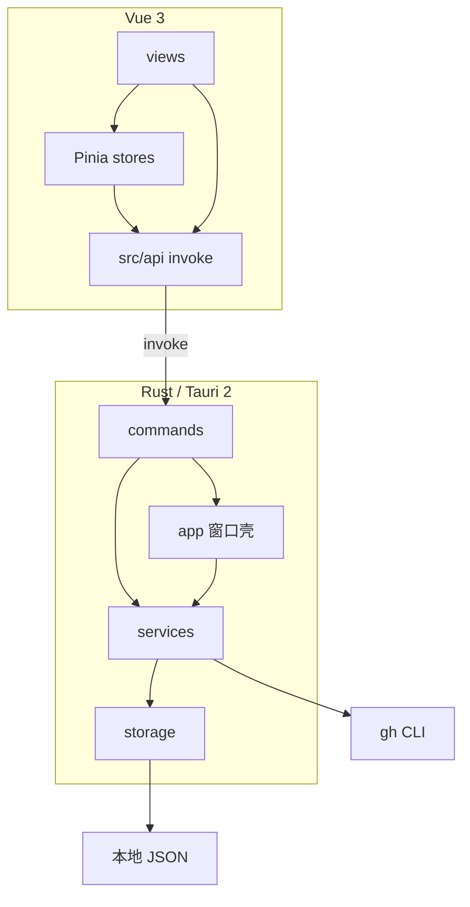
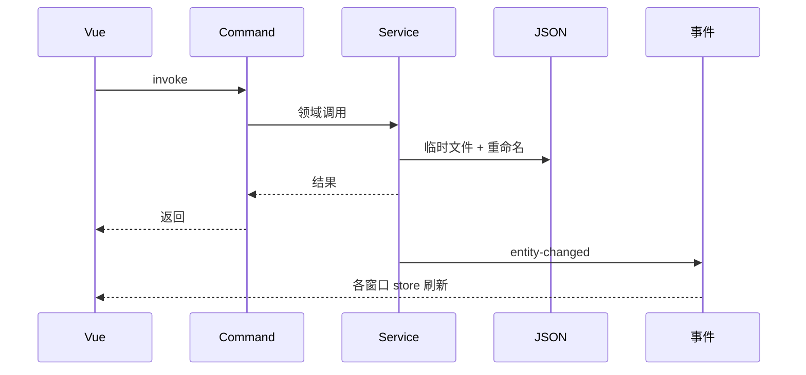

# MayDolist 架构

> 现行系统地图 · 对照代码 `1.3.1` · 2026-09-01
>
> 产品体验见 [README](../README.md)。字段以 `src-tauri/src/models/` 为准，改模型后跑 `pnpm gen:types` 并提交 `src/types/generated/`。

Windows 本地桌面收件箱：1 个 Rust 主进程 + 多个 WebView2（主面板、悬浮便签、快速收集、命令面板）。前端不碰磁盘；GitHub 只通过本机 `gh` CLI。

## 目录

- [分层与数据流](#分层与数据流)
- [代码地图](#代码地图)
- [模块](#模块)
- [存储](#存储)
- [运行时](#运行时)
- [设计不变量](#设计不变量)
- [相关文档](#相关文档)

## 分层与数据流



固定方向：**UI → `invoke` → Command（校验）→ Service（规则）→ 原子写盘 → 事件广播**。Command 不写业务规则；前端不直接读写文件。



## 代码地图

```text
src/                              Vue 3 + TS
  App.vue                         ?note / ?quick / ?palette 分流四个窗口
  views/                          主面板 Tab、悬浮便签、快速收集、命令面板
  stores/                         Pinia；跨窗口靠 entitySync 订 entity-changed
  api/                            唯一 invoke 入口（call + ApiError）
  components/                     列表行、triage、确认条等
  types/                          手写窄化；generated/ 由 ts-rs 生成
  triage.ts                       Inbox 处理模式（纯前端，不落盘）
src-tauri/src/
  lib.rs                          AppState；注册全部 Tauri command
  commands/                       IPC：参数校验、错误转换，转给 service / app
  services/                       领域：todo / note / github / focus / palette / backup
  services/reminder.rs            到期判定纯函数（不在 Services 结构体里）
  models/                         serde 模型；#[ts(export)] → src/types/generated/
  storage/                        数据目录、原子写、config 缓存、域替换
  app/                            窗口、托盘、热键、热角、徽标、后台循环
  events/                         entity-changed
  error.rs                        AppError → 前端 ErrorCode
  logging.rs                      <dataDir>/logs/app.log
  demo.rs                         --demo 隔离模拟数据
```

改一类功能时进这些文件：

| 想改 | Rust | 前端 |
| --- | --- | --- |
| Todo / Inbox | [`models/todo.rs`](../src-tauri/src/models/todo.rs)、[`services/todo.rs`](../src-tauri/src/services/todo.rs)、[`commands/todo.rs`](../src-tauri/src/commands/todo.rs) | [`api/todo.ts`](../src/api/todo.ts)、[`stores/todo.ts`](../src/stores/todo.ts)、[`views/TodoView.vue`](../src/views/TodoView.vue)、[`triage.ts`](../src/triage.ts) |
| 便签 | [`models/note.rs`](../src-tauri/src/models/note.rs)、[`services/note.rs`](../src-tauri/src/services/note.rs)、[`commands/note.rs`](../src-tauri/src/commands/note.rs) | [`api/note.ts`](../src/api/note.ts)、[`stores/note.ts`](../src/stores/note.ts)、[`views/NoteView.vue`](../src/views/NoteView.vue)、[`FloatingNote.vue`](../src/views/FloatingNote.vue) |
| GitHub | [`services/github/`](../src-tauri/src/services/github/)、[`commands/github.rs`](../src-tauri/src/commands/github.rs)、[`models/github.rs`](../src-tauri/src/models/github.rs) | [`api/github.ts`](../src/api/github.ts)、[`stores/github.ts`](../src/stores/github.ts)、[`views/GithubView.vue`](../src/views/GithubView.vue) |
| Focus | [`services/focus.rs`](../src-tauri/src/services/focus.rs)、[`commands/focus.rs`](../src-tauri/src/commands/focus.rs) | [`api/focus.ts`](../src/api/focus.ts)、[`stores/focus.ts`](../src/stores/focus.ts)、[`views/FocusView.vue`](../src/views/FocusView.vue) |
| 到期提醒 / 托盘徽标 | [`services/reminder.rs`](../src-tauri/src/services/reminder.rs)（谁该提醒）、[`app/due_tracking.rs`](../src-tauri/src/app/due_tracking.rs)（循环与 Toast）、[`app/badge.rs`](../src-tauri/src/app/badge.rs) | [`views/MainBoard.vue`](../src/views/MainBoard.vue) 听 `focus-todo` |
| 窗口 / 托盘 / 热键 | [`app/windows.rs`](../src-tauri/src/app/windows.rs)、[`tray.rs`](../src-tauri/src/app/tray.rs)、[`hotkeys.rs`](../src-tauri/src/app/hotkeys.rs)、[`tauri.conf.json`](../src-tauri/tauri.conf.json) | [`App.vue`](../src/App.vue) |
| 备份 / 导入 | [`services/backup.rs`](../src-tauri/src/services/backup.rs)、[`commands/backup.rs`](../src-tauri/src/commands/backup.rs) | [`api/backup.ts`](../src/api/backup.ts)、[`views/SettingsView.vue`](../src/views/SettingsView.vue) |
| 回收站 | [`commands/trash.rs`](../src-tauri/src/commands/trash.rs)（复用 todo / note 的软删除字段） | 设置页 |
| 应用内更新 | [`commands/update.rs`](../src-tauri/src/commands/update.rs)、`tauri.conf.json` updater | [`api/update.ts`](../src/api/update.ts)、[`stores/update.ts`](../src/stores/update.ts) |
| 配置 | [`models/config.rs`](../src-tauri/src/models/config.rs)（`CONFIG_SCHEMA_VERSION = 3`）、[`commands/settings.rs`](../src-tauri/src/commands/settings.rs) | [`stores/settings.ts`](../src/stores/settings.ts) |

Command 清单以 [`lib.rs`](../src-tauri/src/lib.rs) 的 `invoke_handler` 为准。

## 模块

### Rust

| 位置 | 职责 | 不负责 |
| --- | --- | --- |
| [`app/`](../src-tauri/src/app/) `windows` / `tray` / `hotkeys` / `badge` / `due_tracking` | 窗口生命周期、托盘、全局快捷键、热角、逾期徽标、提醒循环、GitHub 定时刷新 | 领域 JSON 的业务规则 |
| [`commands/`](../src-tauri/src/commands/) | 前端唯一 IPC；校验后转 service | 业务规则、直接写盘 |
| [`services/todo.rs`](../src-tauri/src/services/todo.rs) / [`note.rs`](../src-tauri/src/services/note.rs) | 列表与条目、Inbox `kind=inbox`、来源 Todo、周期实例 | UI |
| [`services/github/`](../src-tauri/src/services/github/) | 见下一表 | UI；不存 GitHub token |
| [`services/focus.rs`](../src-tauri/src/services/focus.rs) | 只读投影：并行加载 Todo / Note / GitHub，局部失败隔离 | 任何写路径 |
| [`services/palette.rs`](../src-tauri/src/services/palette.rs) | 命令匹配 + 三域并发搜索（每域上限 8） | 新写路径；GitHub 只读本地缓存 |
| [`services/backup.rs`](../src-tauri/src/services/backup.rs) | ZIP 导出 / 导入校验 / 备份轮转（最近 10 份） | UI |
| [`services/reminder.rs`](../src-tauri/src/services/reminder.rs) | 纯函数：哪些 Todo 到期该提醒 | 不持 Storage；不弹 Toast |
| [`storage/`](../src-tauri/src/storage/) | 目录解析、JSON 原子写、config 内存缓存、损坏隔离 | GitHub 网络 |
| [`models/`](../src-tauri/src/models/) | serde 形状 | IO |
| [`events/`](../src-tauri/src/events/) | `entity-changed` | 业务逻辑 |
| [`demo.rs`](../src-tauri/src/demo.rs) | `--demo`：临时目录 + 固定脱敏数据，跳过真实 gh | 正式数据目录 |

GitHub 服务已拆开（[`services/github/mod.rs`](../src-tauri/src/services/github/mod.rs)）：

| 文件 | 做什么 |
| --- | --- |
| `gh_cli.rs` | 调 `gh` 子进程；解析 REST 响应形状 |
| `watchlist.rs` | 追踪仓库、忽略 / 钉住、过滤器（持久化，不可重建） |
| `refresh.rs` | 按仓库串行刷新快照：`gh api` REST（search / issues / pulls / checks） |
| `sync.rs` | 已关联 Todo 的来源状态：每仓库一次 **`gh api graphql`**；关闭 / 合并可自动完成 |
| `signals.rs` | `ActionSignal`（`needsAction` / `needsReview` / `ciFailed` / `stale` / `draft`） |

`stale` 按 `config.githubStaleDays`（默认 14，0 关闭）在**读取快照时**重算，不依赖上次刷新时刻。

### Vue

| 位置 | 职责 |
| --- | --- |
| [`views/`](../src/views/) | 主面板 Tab（Focus / Todo / 便签 / GitHub / 设置）、`FloatingNote`、`QuickCapture`、`CommandPalette` |
| [`stores/`](../src/stores/) | UI 状态与缓存；[`entitySync.ts`](../src/stores/entitySync.ts) 单次监听 `entity-changed` 并防抖刷新 |
| [`api/`](../src/api/) | `call()` 封装 invoke，把 `AppError` 收成 `ApiError` |
| [`components/`](../src/components/) | 可复用卡片、行、triage、确认条 |
| [`triage.ts`](../src/triage.ts) | Inbox 逐条处理：动作映射与光标，状态只在内存，落盘走现有 todo command |
| [`types/generated/`](../src/types/generated/) | ts-rs；其余 `types/*.ts` 为 re-export 或字面量窄化 |

## 存储

默认目录：`%USERPROFILE%\Documents\MayDolist`。启动时可用 `MAYDOLIST_DATA_DIR`；设置里迁移数据目录后由 bootstrap 记住。

```text
MayDolist/
├── config.json              # 单例；schemaVersion 当前为 3
├── backups/                 # 时间戳 ZIP，保留最近 10 份
├── logs/app.log             # 不进导出包
├── notes/<id>.json
├── todos/<id>.json          # 一个文件一个列表
└── github/
    ├── watchlist.json       # 追踪与忽略 / 钉住（不可重建）
    └── cache/<repo>.json    # PR / Issue 快照（可重建）
```

- 实体一文件，文件名 = UUID。每份 JSON 有 `schemaVersion`；新字段一律可选 + serde 默认值，缺省不落盘。
- Todo 列表用 `kind=inbox` 标记系统收件箱。条目可带 `source`（`github-issue` / `github-pr`）、`githubSync`、`dueDate` / `remindAt` / `repeat`。
- 写入：进程内 Mutex 串行；临时文件 + 重命名。先写盘成功再广播。
- JSON 损坏：隔离该文件，不拖垮整个数据目录。
- 导出 / 备份是同一 ZIP 布局（`packageSchemaVersion = 1`）：`manifest.json` + config + notes + todos + github watchlist，可选 cache。不含 `logs/`、`backups/`、token。导入先在 staging 校验（版本、路径穿越、可解析），再备份当前数据后持锁交换；失败逐项回滚。

## 运行时

### 窗口

| label | 创建 | 前端入口 |
| --- | --- | --- |
| `main` | `tauri.conf.json`，启动可隐藏 | `App.vue` 默认 → `MainBoard.vue` |
| `quick-capture` | 配置里预创建，默认隐藏 | `index.html?quick` |
| `command-palette` | 同上；呼出时居中到光标所在屏 | `index.html?palette` |
| `note-<uuid>` | 运行时按便签创建 | `index.html?note=<id>` |

能力集：[`capabilities/default.json`](../src-tauri/capabilities/default.json)（`main`、`note-*`、`quick-capture`、`command-palette`）。前端无文件系统权限。

### 事件

| 事件 | 何时 | 谁听 |
| --- | --- | --- |
| `entity-changed` | 领域写盘成功后 | 各 Pinia store（经 `EntitySyncer`） |
| `settings-changed` | 改配置或导入后 | `stores/settings.ts` |
| `focus-todo` | 点击到期 Toast | `MainBoard.vue` → 打开今日并高亮 |
| `tray-action` | 托盘菜单 | `MainBoard.vue`（新建便签 / 刷新 GitHub / 设置） |

### 后台循环

[`app/due_tracking.rs`](../src-tauri/src/app/due_tracking.rs) 在 Rust 进程里跑，不经过前端：

- **提醒**：约 15s 扫描未完成 Todo；`remindAt <= now` 且尚未对应该时刻写过 `lastRemindedAt` 则发 Windows Toast（安静时段只记抑制、仍更新 `lastRemindedAt`）。通知失败只记日志。
- **托盘徽标**：逾期未完成条数；0 则去掉徽标。
- **GitHub**：按 `githubRefreshIntervalMinutes`（0 关闭）串行 `refresh_all`；若开启同步则接着 GraphQL `sync_linked_todos`。同一仓库同时只允许一次刷新。

Demo：`pnpm demo` → 进程参数 `--demo`，数据在系统临时目录，不读正式目录、不打真实 GitHub。

## 设计不变量

**非目标（明确不做）**

- 云同步、多端、移动端 / Web 端。
- 应用内 GitHub 登录或读取 / 存储 token（凭据只在 `gh`）。
- 把本地 JSON 整体换成数据库。
- GitHub 写操作（创建 PR、合并、评论）；外链一律系统浏览器。
- 完整项目管理（里程碑、团队协作）。

**安全**

- capabilities 最小化；CSP 在 `tauri.conf.json`。
- 导入包白名单布局 + 拒绝 `..` / 绝对路径。
- 便携版 EXE 文件名含 `portable` 时 updater 不替换正在运行的文件。

**向后兼容**

- 新字段可选；加载旧 `config.json` 时 `sanitize` 补齐并升到 schema 3 后回写。
- 读取非法日期降级为无日期，不崩溃；非法组合在 service 层拒绝写入。
- Focus、命令面板、triage **不**为自身新增持久化格式。

**一致性**

- 单写者；先盘后事件。
- `github/cache` 可丢，watchlist 与用户实体不可丢。
- Focus / Palette 只读本地快照，刷新失败保留旧缓存并记 `lastError`。

## 相关文档

- [README](../README.md)：产品、开发运行、质量检查。
- [building.md](building.md)：CI、NSIS、Release 签名与 updater。
- [CHANGELOG](../CHANGELOG.md)：版本演进（当前 `1.3.1`）。
- [issue-tracker.md](issue-tracker.md)：已完成的 issue 编排日志（归档，不是活任务板）。
